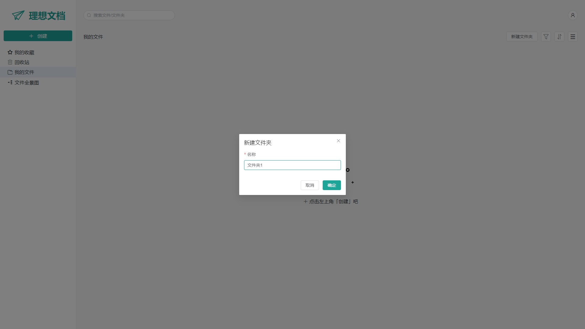

# 工作台

工作台提供登录注册、文件和文件夹的创建和管理功能。

## 动图

1.登录、文件和文件夹管理

2.文件全景图

3.用户头像和昵称修改

## 截图

1.登录界面，目前提供用户名密码的方式注册和登录

2.第一次登录进去会默认创建一个根文件夹

3.点击左上角【创建】按钮可以创建各种类型的文件，文件和文件夹区域鼠标右键会显示右键菜单，可创建文件和文件夹，右上角【新建文件夹】按钮可以在当前选中的文件夹下创建文件夹

4.文件或文件夹支持【重命名】、【复制或移动】、【删除】操作，文件还支持【收藏】操作，点击名称旁边的五角星图标即可

5.可以按住文件或文件夹卡片进行拖拽来快速移动文件或文件夹

6.点击文件夹会进入该文件夹，会显示该文件夹下的文件夹和文件，点击上方的文件夹路径可以快速切换文件夹，同时左侧的文件夹树也可以点击进行快速定位

7.在上方搜索框中可以搜索文件或文件夹，点击搜索出来的文件夹可以直接定位到该文件夹，文件也可以定位到其所在文件夹

8.文件列表支持按文件类型过滤

9.文件或文件夹列表支持按一些字段进行排序

10.可以切换为列表视图

11.删除的文件或文件夹会进入回收站，可以进行恢复或永久删除

12.可以在【我的收藏】页面查看收藏的文件

13.在【文件全景图】页面可以查看所有的文件和文件夹，双击可以修改名称，拖动可以移动位置，按删除键可以删除，按 Ctrl+c/v 可以复制

14.点击右上角头像可以显示下拉菜单，可以进入个人主页、修改密码和退出登录

15.个人主页中可以修改头像和昵称

